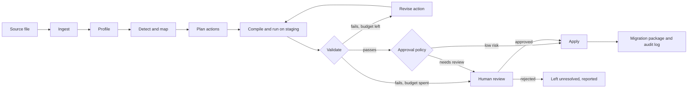

# Architecture

Mapwright takes a messy legacy export and produces a validated table in a
target contract, plus a replayable migration script and an audit trail.

The design rule throughout: **the LLM proposes, code decides.** Code owns
parsing, profiling, structural checks, SQL generation, execution,
validation, approval policy and logging. The LLM is used where meaning is
needed: understanding columns, resolving semantic variants, and revising
a fix that failed validation.

## Pipeline



The overall flow is a fixed pipeline, because the steps are known in
advance. The only agent-style part is the bounded repair loop
(compile → validate → revise), where the next step depends on what failed.

## Stages

| Stage | Owner | What it does |
| --- | --- | --- |
| Ingest | Code | Detects encoding (UTF-8, UTF-8 with BOM, Windows-1256), delimiter and header row. Loads every column as text into an immutable `raw` table in DuckDB. |
| Profile | Code | Per column: null and blank counts, distinct counts, top values, length range, character-class pattern signatures, parse rates for each candidate type. |
| Structural detection | Code | Contract-driven checks: type parse failures, missing required values, duplicates, key conflicts, ranges, formats, orphan foreign keys. |
| Schema mapping | Code, then LLM | Rules first: synonym dictionary and header similarity. Unmapped or low-confidence columns go to the LLM with their profiles. |
| Semantic detection | LLM | Given a column's profile and distinct values: synonyms, disguised missing values, embedded units, free-text enums, misplaced values, date-order evidence. |
| Planning | Code and LLM | Every finding becomes a typed action. Rules emit actions directly; the LLM emits actions as JSON that must pass schema validation. |
| Compile and run | Code | Each action compiles to SQL and runs on a staging copy. `raw` is never modified. Each action produces a new staging view, so every change has lineage. |
| Validate | Code | Contract checks on the result, plus the action's own postconditions. |
| Revise | LLM | A failed action, its failure report and samples go back to the LLM for a corrected action. At most 2 revisions, then it escalates. |
| Approval | Code policy, human decision | Deterministic policy decides auto-apply or review. Reviewers see a before/after diff and affected row counts. |
| Apply and package | Code | Writes the target table and the migration package. |

## Actions

The LLM never writes free SQL. It chooses from a fixed set of typed
actions, which code compiles to SQL:

| Action | Purpose |
| --- | --- |
| `map_column` | Source column → target field |
| `combine_columns` | Several source columns → one target field |
| `split_column` | One source column → several target fields |
| `drop_column` | Irrelevant source column |
| `normalize_text` | Trim, collapse spaces, case |
| `map_values` | Explicit raw → canonical value dictionary |
| `parse_date` | Explicit input format(s) → ISO date |
| `parse_number` | Separators, symbols, scale suffixes → decimal |
| `normalize_phone` | Local formats → E.164, with a default country |
| `set_null` | Explicit list of disguised-missing tokens → null |
| `deduplicate` | Key columns and a resolution strategy |
| `drop_rows` | Typed predicate; always requires review |

Every action records its origin (rules or LLM), a rationale, a confidence
(LLM actions only), and the expected effect (rows and cells touched).

Why a fixed vocabulary instead of letting the model write SQL:

- Actions are checkable before they run (unknown columns or values are
  rejected).
- Each action type has its own postconditions.
- Compiled SQL is predictable, so the migration script is reviewable.
- Evaluation can attribute every change to a specific decision.

## Validation

Two layers, both deterministic:

1. **Contract checks** from `contracts/*.yaml`: types, required fields,
   uniqueness, ranges, patterns, allowed values, reference lists, foreign
   keys.
2. **Action postconditions**, for example:
   - `parse_date`: unparsed share below a threshold; no previously
     non-null value becomes null unless listed in `set_null`.
   - `map_values`: every output value is in the target's allowed set.
   - `drop_rows`, `deduplicate`: actual row delta equals the declared delta.

Passing validation does not mean the output is correct. The evaluation
measures that gap directly (silent-error rate).

## Approval policy

Deterministic rules, applied after validation. An action goes to review
if any of these is true:

- It removes rows (`drop_rows`, or `deduplicate` with conflicting values).
- It changes more than 20% of a column's non-null values.
- It is an LLM action with confidence below 0.8.
- It addresses an issue whose type is marked `review` in
  `benchmark/issue_types.yaml`, for example missing required values, key
  conflicts, orphan keys, out-of-range values, merged fields, ambiguous
  date order, embedded units and misplaced values.
- It still fails validation after the revision budget.

Thresholds live in one config file so their effect can be measured.

## What the LLM sees

Profiles, column names, up to 50 most frequent distinct values plus 20
random ones per column, and up to 10 sample rows. Never the full table.
This bounds cost per case regardless of row count, and keeps most of the
data out of prompts.

Every response is validated against a Pydantic schema. A malformed
response gets one retry; after that it counts as a hallucinated action in
the evaluation.

## Outputs

For each run, `runs/<run-id>/`:

- `target.csv` (and the DuckDB table): the onboarded data
- `plan.json`: every action with origin, rationale, approval decision
- `migration.sql`: the compiled, replayable SQL, from `raw` to target
- `report.md`: what was found, fixed, escalated and left unresolved
- `audit.jsonl`: append-only log. One event per step: actor (rules, LLM
  or a named reviewer), action, input and output table hashes, model and
  prompt version, tokens, timestamp.

## Stack

All local; nothing is deployed.

| Concern | Choice | Reason |
| --- | --- | --- |
| Language | Python 3.11+ | |
| Engine | DuckDB | In-process SQL, fast on files, no server |
| Schemas | Pydantic v2, YAML contracts | Typed actions and LLM output validation |
| LLM | Gemini (free tier) behind a small provider interface, plus a cached replay provider | Swappable model; replay makes evaluation reproducible without an API key |
| CLI | Typer | `mapwright run`, `mapwright bench` |
| Review UI | Small FastAPI app, server-rendered pages | Only for reviewing escalated actions; built last |
| Tests | pytest | |

Deliberately not used: RAG, vector databases, multiple agents, LangChain,
LangGraph, cloud services. None of them solves a problem this system has.
The orchestration is a short loop that is easier to test and explain when
it is plain code.

## Repository layout

```
contracts/          target contracts (YAML)
reference/          reference lists (cities)
benchmark/
  issue_types.yaml  issue taxonomy
  generator/        clean records, legacy styles, issue injection
  datasets/         D01–D08, H01–H04
src/mapwright/
  ingest.py  profile.py  contracts.py
  detect/            structural.py  semantic.py
  mapping.py  actions.py  compiler.py  executor.py
  validate.py  policy.py  repair.py  audit.py
  llm/               provider.py  gemini.py  cache.py  prompts/
  pipeline.py  cli.py
evaluation/         loading.py  scorer.py  aggregate.py  report.py  baselines.py
tests/
docs/
```
