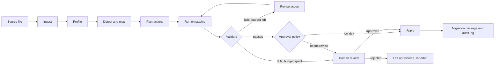

# Architecture

Mapwright takes a messy legacy export and produces a validated table in a
target contract, plus a replayable migration plan and an audit trail.

The design rule throughout: **the LLM proposes, code decides.** Code owns
parsing, profiling, structural checks, execution,
validation, approval policy and logging. The LLM is used where meaning is
needed: understanding columns, resolving semantic variants, and revising
a fix that failed validation.

## Pipeline



The overall flow is a fixed pipeline, because the steps are known in
advance. The only agent-style part is the bounded repair loop
(run → validate → revise), where the next step depends on what failed.

## Stages

| Stage | Owner | What it does |
| --- | --- | --- |
| Ingest | Code | Detects encoding (UTF-8, UTF-8 with BOM, Windows-1256), delimiter and header row, skipping title rows. Every value stays text, and every row keeps its source row number. The source table is never modified. |
| Profile | Code | Per column: null and blank counts, distinct counts, top values, length range, character-class pattern signatures, parse rates for each candidate type. |
| Structural detection | Code | Contract-driven checks: type parse failures, missing required values, duplicates, key conflicts, ranges, formats, orphan foreign keys. |
| Schema mapping | Code, then LLM | Rules first: synonym dictionary and header similarity. Unmapped or low-confidence columns go to the LLM with their profiles. |
| Semantic detection | LLM | Given a column's profile and distinct values: synonyms, disguised missing values, embedded units, free-text enums, misplaced values, date-order evidence. |
| Planning | Code and LLM | Every finding becomes a typed action. Rules emit actions directly; the LLM emits actions as JSON that must pass schema validation. |
| Run on staging | Code | Each action is first computed into an effect: the exact cells it would change and rows it would remove. Nothing is written until the policy has decided, so a held action leaves no trace. Every change keeps its source row, so it has lineage. |
| Validate | Code | Contract checks on the result, plus the action's own postconditions. |
| Revise | LLM | A failed action, its failure report and samples go back to the LLM for a corrected action. At most 2 revisions, then it escalates. |
| Approval | Code policy, human decision | Deterministic policy decides auto-apply or review. Reviewers see a before/after diff and affected row counts. |
| Apply and package | Code | Writes the target table and the migration package. |

## Actions

The LLM never writes free code or SQL. It chooses from a fixed set of
typed actions, which code executes:

| Action | Purpose |
| --- | --- |
| `map_column` | Source column → target field |
| `combine_columns` | Several source columns → one target field |
| `split_column` | One source column → several target fields |
| `drop_column` | Irrelevant source column |
| `normalize_text` | Trim, collapse spaces, case |
| `map_values` | Explicit raw → canonical value dictionary |
| `parse_date` | Explicit input format(s) → ISO date |
| `parse_number` | Separators, symbols, scale suffixes → decimal |
| `normalize_phone` | Local formats → E.164, with a default country |
| `set_null` | Explicit list of disguised-missing tokens, or listed rows (invalid values), → null |
| `move_value` | Values typed into the wrong column move to the right one, only where it is empty |
| `deduplicate` | Key columns and a resolution strategy |
| `drop_rows` | Typed predicate; always requires review |

Every action records its origin (rules or LLM), a rationale, a confidence
(LLM actions only), and the expected effect (rows and cells touched).

Why a fixed vocabulary instead of letting the model write code:

- Actions are checkable before they run (unknown columns or values are
  rejected).
- Each action type has its own postconditions.
- Execution is predictable, so the plan is reviewable and replays exactly.
- Evaluation can attribute every change to a specific decision.

## Validation

Two layers, both deterministic:

1. **Contract checks** from `contracts/*.yaml`: types, required fields,
   uniqueness, ranges, patterns, allowed values, reference lists, foreign
   keys.
2. **Action postconditions**, for example:
   - `parse_date`: unparsed share below a threshold; no previously
     non-null value becomes null unless listed in `set_null`.
   - `map_values`: every output value is in the target's allowed set.
   - `drop_rows`, `deduplicate`: actual row delta equals the declared delta.

Passing validation does not mean the output is correct. The evaluation
measures that gap directly (silent-error rate).

## Approval policy

Deterministic rules in `src/mapwright/policy.py`, applied after an
action's effect is computed and its postconditions pass. Each action gets
one of three decisions:

- **apply**: committed, nothing to review.
- **flag**: committed, and the touched cells are listed for a person to
  confirm. Used when the rule is certain but the issue type requires
  sign-off, for example an amount written as `12.5K` or day-first dates
  settled by evidence.
- **hold**: not committed. The proposed change waits for approval, and the
  data keeps its previous value until then.

An action is held if any of these is true:

- It removes rows (`drop_rows`, or `deduplicate` with conflicting values).
- The rule could not settle how to read the values (day/month order with
  no evidence either way).
- It is an LLM action with confidence below 0.8.
- It is an LLM action that changes more than 20% of a column's non-null
  values. Rules actions are exempt: they are deterministic dictionary and
  format conversions, and column-wide formats are the normal case.
- It still fails validation after the revision budget.

Otherwise, an action is flagged if any change it makes addresses an issue
whose type is marked `review` in `benchmark/issue_types.yaml` (missing
required values, key conflicts, orphan keys, out-of-range values, merged
fields, ambiguous date order, embedded units, misplaced values).

What the rules detect but cannot fix (an unknown value, a missing required
value, an out-of-range amount) is left as it is and escalated, never
guessed.

Thresholds live in one config file, `src/mapwright/policy.yaml`, so their
effect can be measured.

## What the LLM sees

Profiles, column names, up to 50 most frequent distinct values plus 20
random ones per column, and up to 10 sample rows. Never the full table.
This bounds cost per case regardless of row count, and keeps most of the
data out of prompts.

Every response is validated against the action schema. A malformed
response gets one retry; after that it counts as a hallucinated action in
the evaluation.

## Outputs

For each run, `<out>/`:

- `target.csv`: the onboarded data, with `_source_row` for lineage
- `result.json`: mapping, detections, actions and escalations, in the
  format the scorer reads
- `plan.json`: every action with its parameters, origin, rationale,
  decision and effect, plus the ingest settings and column profiles.
  `python -m mapwright replay` re-applies it to the source file, and can
  apply held actions once they are approved
- `report.md`: what was found, fixed, flagged and held

Still to come: `audit.jsonl`, an append-only log with one event per step
(actor, action, input and output hashes, model and prompt version, tokens,
timestamp), and an optional SQL export of the plan.

## Stack

All local; nothing is deployed.

| Concern | Choice | Reason |
| --- | --- | --- |
| Language | Python 3.11+ | |
| Engine | Plain Python over lists of rows | Files are hundreds of rows; typed actions keep the plan replayable without a SQL layer |
| Schemas | Dataclasses for typed actions, YAML contracts and rule dictionaries | Few dependencies; everything testable anywhere |
| LLM | Gemini (free tier) behind a small provider interface, plus a cached replay provider | Swappable model; replay makes evaluation reproducible without an API key |
| CLI | argparse | `python -m mapwright run`, `python -m mapwright replay` |
| Review UI | Small FastAPI app, server-rendered pages | Only for reviewing escalated actions; built last |
| Tests | pytest (tests are unittest-style, so `python -m unittest` works too) | |

Deliberately not used: RAG, vector databases, multiple agents, LangChain,
LangGraph, cloud services. None of them solves a problem this system has.
The orchestration is a short loop that is easier to test and explain when
it is plain code.

## Repository layout

```
contracts/          target contracts (YAML)
reference/          reference lists (cities)
benchmark/
  issue_types.yaml  issue taxonomy
  generator/        clean records, legacy styles, issue injection
  datasets/         D01–D08, H01–H04
src/mapwright/
  ingest.py         encoding, delimiter and header detection
  profile.py        column profiles
  mapping.py        header synonyms, similarity, column contents
  dictionaries.py   rules/*.yaml: header synonyms, value variants, placeholders
  normalize.py      value parsers: dates, numbers, phones, text
  actions.py        the typed actions and the staging workspace
  planner.py        rules-only planner: proposes actions, reports findings
  validate.py       action postconditions
  policy.py         apply / flag / hold (thresholds in policy.yaml)
  pipeline.py       the fixed pipeline, replay, detections
  output.py  cli.py contracts.py  canonical.py
  llm/              provider, Gemini, cache, prompts (next)
evaluation/         loading.py  scorer.py  aggregate.py  report.py  baselines.py
tests/
docs/
```
